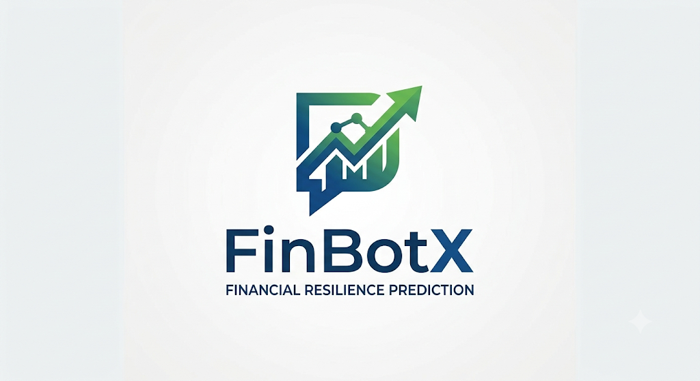
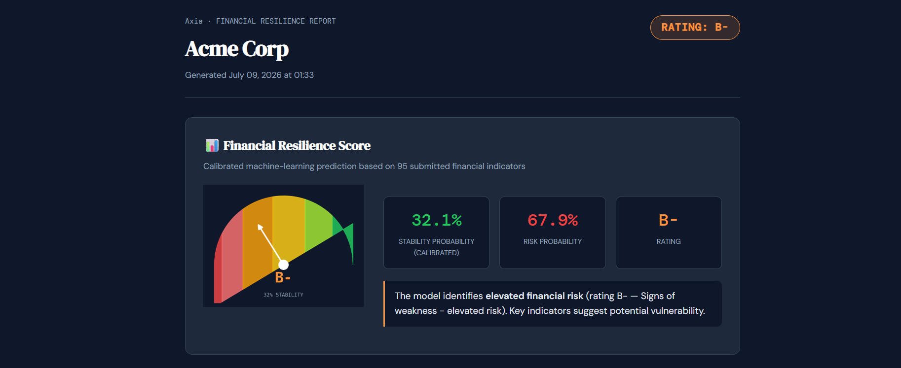
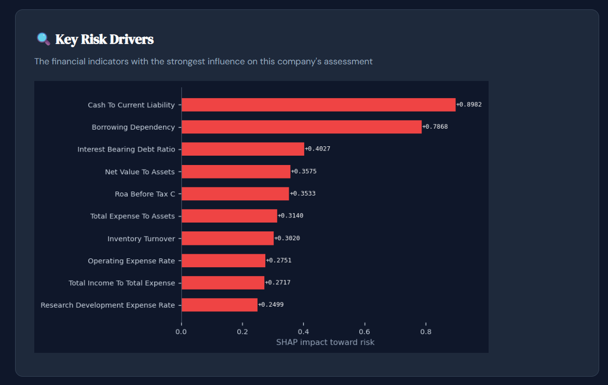
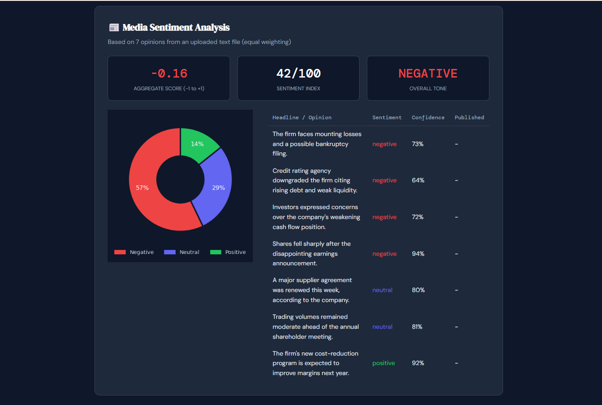

# Axia — Financial Resilience Prediction & Market Sentiment AI

Axia is an advanced, AI-driven platform that predicts a company's financial resilience. By synthesizing complex financial ratios with recency-weighted market sentiment, Axia delivers professional, self-contained HTML reports featuring calibrated credit-style ratings (A+ … D).




*The financial resilience dashboard showing the calibrated risk probability and credit-style rating (A+ ... D).*

## Architecture

| Layer | Component | Technology |
|---|---|---|
| Financial model | `src/bankruptcy_engine.py` | XGBoost + isotonic calibration (scikit-learn) |
| Sentiment model | `src/sentiment_engine.py` | TF-IDF bigrams + SMOTE + Logistic Regression |
| News ingestion | `src/news_scraper.py` | Public RSS feeds, 3-day freshness window |
| Explainability | SHAP TreeExplainer (cached) | `shap` |
| Report | `src/report_generator.py` | Self-contained HTML + base64 charts |
| Client | `app.py` | Streamlit |
| Configuration | `src/config.py` | Rating scale, news window, thresholds |

## Key design decisions

**Honest metrics, not vanity accuracy.** Only ~3.2% of companies in the
Taiwan Economic Journal dataset are at risk, so a dummy "always stable"
model scores ~96.8% accuracy. Axia therefore optimizes and reports
**recall / precision / ROC-AUC for the at-risk class**.

## Local Explainability (SHAP)

Axia doesn't just output a score; it explains *why*. The model calculates SHAP (SHapley Additive exPlanations) values to highlight the specific financial indicators driving the company toward risk or stability.


*Local explainability via SHAP, demonstrating the top features influencing the specific prediction.*

## NLP Market Sentiment

By leveraging TF-IDF bigrams and Logistic Regression (trained with SMOTE for class imbalance), Axia contextualizes hard financial data with real-world market sentiment.


*Recency-weighted NLP sentiment analysis combining financial news or opinions into an aggregate risk index.*

## Setup

```bash
pip install -r requirements.txt
python main.py          
# or directly:
streamlit run app.py
``` 

## Authors

**Tamar Waiss** & **Rina Kimmel**

[](https://www.linkedin.com/in/tamar-waiss)
[](https://www.linkedin.com/in/rina-kimmel-7963ba413)

---
*Disclaimer: Axia is an academic machine-learning system and does not constitute financial advice.*